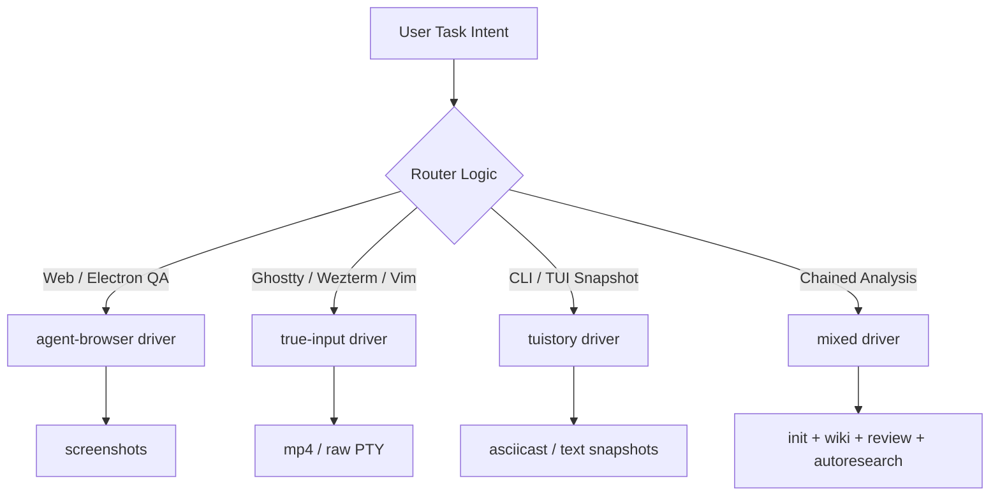

# Pi Agent Control Extension

Pi Agent Control Extension is a Pi extension package for terminal, CLI, browser-routing, capture, verification, QA proof, and showcase workflows. It provides commands and LLM tools that turn loose automation requests into a repeatable driver, skill stack, capture format, and evidence recipe.

[](#)
[](#)
[](#)
[](#)

## Install

```bash
pi install git:github.com/OnlineChef/pi-agent-control-extension
```

Then start or reload a Pi session. The extension registers commands, tools, bundled skills, routing rules, and package validation helpers.

## What it gives you

| Area | Capability |
|---|---|
| Routing | Selects `tuistory`, `true-input`, or `agent-browser` from the task intent |
| Capture | Recommends casts, screenshots, mp4, or report-only evidence |
| Verification | Produces commitment and evidence schemas for audit-friendly proof |
| QA | Generates QA report structures with expected, observed, result, and evidence columns |
| Showcase | Provides recipes for demo capture and Remotion-based composition |
| Guardrails | Blocks risky capture and shell patterns before they become expensive mistakes |
| Testing | Fully unit, E2E, strict TypeScript, and Ruff Python tested in CI/CD |

## Commands

| Command | What it does |
|---|---|
| `/skills-control` | Lists bundled skill atoms |
| `/route-control <task>` | Routes a task to driver, skills, capture, deliverable, warnings, and recipe |
| `/capture <target> [--format mp4|cast|png|report]` | Unified evidence capture: auto-selects driver and format |
| `/showcase-preview <recipe>` | Preview showcase render props for a recipe |
| `/showcase-render <recipe>` | Render a Remotion showcase video from a recipe |
| `/skill-merge <name>` | 3-way merge a user skill with its PI version |
| `/merge-list` | List all recorded skill merge states |
| `/bridge-start [--port]` | Start the remote agent WebSocket bridge |
| `/bridge-status` | Show remote agent bridge status |
| `/demo-control` | Shows the canonical tuistory capture recipe |
| `/verify-control` | Shows the required verification and evidence schema |
| `/qa-control` | Shows the QA report template |
| `/doctor-control` | Runs the package validator |

## Capture & Showcase

Capture evidence with a single command. The orchestrator inspects your target, picks the right driver (`agent-browser`, `tuistory`, or `true-input`), and generates the evidence artifact.

```bash
/capture https://example.com --format mp4
/capture "npm run dev" --format cast
/capture "tui-story login" --format report
```

Supported formats: `mp4`, `cast`, `png`, `report`.

The result is validated against the evidence schema and can be viewed in the Skill Studio TUI evidence pane.

### Showcase Rendering

Turn a capture run into a Remotion showcase video. Each recipe auto-selects preset, layout, and transitions.

```bash
/showcase-preview showcase-compose
/showcase-render showcase-compose
/showcase-render tuistory-launch artifacts/runs/run-2026-05-27/evidence/capture.cast
```

Recipes: `tuistory-launch`, `browser-loop`, `showcase-compose`, `qa-report`.

Or from the shell:

```bash
npm run showcase:render -- showcase-compose
```

## Skill Merge

When a user skill overrides a PI skill, resolve conflicts with a 3-way merge.

```bash
/skill-merge agent-browser
/merge-list
```

Conflicts are shown with line-level context. Resolve with `--pi`, `--user`, or `--manual`. Merge state is persisted in `~/.config/devin/skill-studio.json`.

In the Skill Studio TUI, press `m` on a selected skill to trigger merge.

## Remote Agent Bridge

Expose the extension as a WebSocket server so remote agents or CI systems can trigger captures and renders.

```bash
/bridge-start 8765
/bridge-status
```

Connect with: `ws://localhost:8765?token=<TOKEN>`

Message types: `ping`, `skill.list`, `capture.start`, `render.start`, `bridge.status`, `bridge.broadcast`.

## LLM tools

| Tool | Purpose |
|---|---|
| `control_route` | Route a task programmatically |
| `control_recipe` | Return a canonical workflow recipe |
| `control_evidence_schema` | Return the evidence schema |
| `control_skill_index` | List bundled skills and missing expected skills |
| `control_doctor` | Run package validation |
| `control_verify_commitments` | Check a verification report for core commitment and evidence sections |

## Skill atoms

Control skills:

`agent-browser` · `capture` · `compose` · `pi-agent-cli` · `pi-agent-control` · `pty-capture` · `showcase` · `true-input` · `tuistory` · `verify`

Advanced/Chained skills:

`init` · `wiki` · `review` · `autoresearch` · `session-navigation`

## Routing model

Three lookups drive most decisions: intent, required proof format, and target runtime.




## Evidence contract

Every run should produce a stable run directory:

```text
artifacts/runs/<timestamp>-<slug>/
  run.json
  transcript.md
  evidence/
  verification.md
```

Each claim should map to a step, driver, evidence file, result, and reason. Do not mark a task complete until visible evidence supports the stated commitment.

## Guardrails

The extension inspects shell-style tool calls and blocks known unsafe patterns, including broad `rm -rf`, direct `.env` reads or edits, missing `--repo-root` in pi-agent launches, and tuistory launches that omit color-preserving environment variables.

## Security Hardening

The extension applies defense-in-depth across all modules that handle user input or network I/O:

| Layer | Protection |
|---|---|
| **Path traversal** | Skill names are validated against `^[a-zA-Z0-9_-]+$` before any filesystem access (`mergeSkill`, `resolveMerge`, `checkSkillUpdateConflict`) |
| **Path traversal** | `showcaseRender` rejects `../` and absolute paths in `capturePath` and `outPath` before spawning the render script |
| **Memory leaks** | WebSocket bridge removes clients on both `close` and `error` events; server error resets state so restart is possible |
| **Resilience** | `capture.ts` wraps `mkdirSync` in `try/catch` — directory creation is best-effort, not fatal |
| **Input validation** | `validateEvidence()` checks evidence ID length, required fields, and known formats against the schema |
| **Shell safety** | All driver modules generate command strings but never `exec` them directly; execution is delegated to the user's shell or Pi's tool system |

## Validate

```bash
npm run validate
npm run pack:dry
```

`npm run validate` checks the package structure, required files, manifest entries, skill inventory, and demo artifact.

## Roadmap & Future Plans

Interested in what's next for the extension? Check out our [ROADMAP.md](docs/ROADMAP.md) for upcoming features like LLM-powered guardrails, native Playwright integration, and remote tmux orchestration.

## Demo


