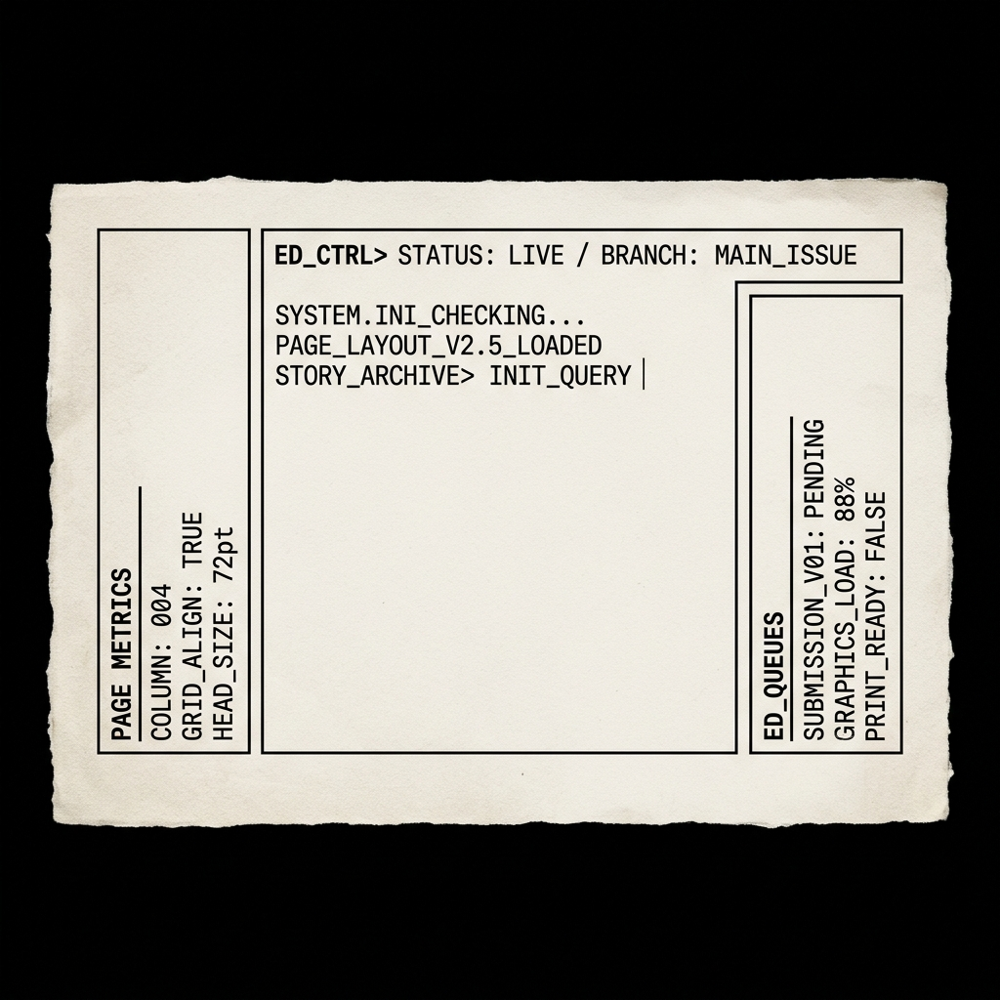
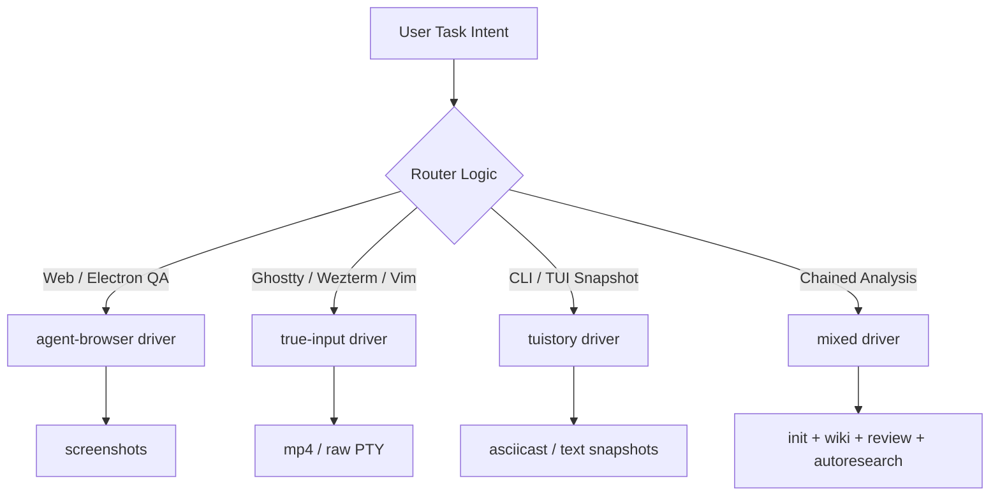

# // PI AGENT CONTROL EXTENSION




Pi Agent Control Extension operates as a strictly structured Pi extension package for terminal, CLI, browser-routing, capture, verification, QA proof, and showcase workflows. It enforces repeatable drivers, skill stacks, capture formats, and evidence recipes from unformatted automation requests.

[](#)
[](#)
[](#)
[](#)

---

## // INSTALLATION

```bash
pi install npm:@onlinechefgroep/pi-agent-control-extension
```

Initialize or reload a Pi session. Registers commands, tools, bundled skills, routing rules, and package validation functions.

---

## // CAPABILITIES

| Area | Capability |
|---|---|
| Routing | Maps task intent to `tuistory`, `true-input`, or `agent-browser` |
| Capture | Forces outputs to casts, screenshots, mp4, or report-only evidence |
| Verification | Outputs commitment and evidence schemas for audit-friendly proof |
| QA | Enforces QA report structures with expected, observed, result, and evidence states |
| Showcase | Executes recipes for demo capture and Remotion-based composition |
| Guardrails | Intercepts risky capture and shell patterns prior to execution |
| Testing | Mandates unit, E2E, strict TypeScript, and Ruff Python validation in CI/CD |

---

## // COMMANDS

| Command | Action |
|---|---|
| `/skills-control` | Outputs bundled skill atoms |
| `/route-control <task>` | Routes task to driver, skills, capture, deliverable, warnings, and recipe |
| `/capture <target> [--format mp4\|cast\|png\|report]` | Executes unified evidence capture; auto-selects driver and format |
| `/showcase-preview <recipe>` | Outputs showcase render props for a recipe |
| `/showcase-render <recipe>` | Executes a Remotion showcase video render from a recipe |
| `/skill-merge <name>` | Executes 3-way merge of a user skill with the PI version |
| `/merge-list` | Outputs all recorded skill merge states |
| `/bridge-start [--port]` | Initializes remote agent WebSocket bridge |
| `/bridge-status` | Outputs remote agent bridge status |
| `/demo-control` | Outputs canonical tuistory capture recipe |
| `/verify-control` | Outputs required verification and evidence schema |
| `/qa-control` | Outputs QA report template |
| `/doctor-control` | Executes package validator |

---

## // CAPTURE & SHOWCASE

Capture evidence with unified commands. The orchestrator inspects the target, determines the optimal driver (`agent-browser`, `tuistory`, or `true-input`), and outputs the evidence artifact.

```bash
/capture https://example.com --format mp4
/capture "npm run dev" --format cast
/capture "tui-story login" --format report
```

Supported formats: `mp4`, `cast`, `png`, `report`.
Results are strictly validated against the evidence schema and accessible in the Skill Studio TUI evidence pane.

### // SHOWCASE RENDERING

Convert a capture run into a Remotion showcase video. Recipes automate preset, layout, and transition selection.

```bash
/showcase-preview showcase-compose
/showcase-render showcase-compose
/showcase-render tuistory-launch artifacts/runs/run-2026-05-27/evidence/capture.cast
```

Available recipes: `tuistory-launch`, `browser-loop`, `showcase-compose`, `qa-report`.

Manual shell execution:
```bash
npm run showcase:render -- showcase-compose
```

---

## // SKILL MERGE

Resolve overrides between user skills and PI skills via 3-way merge.

```bash
/skill-merge agent-browser
/merge-list
```

Conflicts are presented with line-level context. Resolution requires `--pi`, `--user`, or `--manual`. Merge state is committed to `~/.config/devin/skill-studio.json`.
In the Skill Studio TUI, press `m` on a selected skill to initialize the merge sequence.

---

## // REMOTE AGENT BRIDGE

Exposes the extension via a WebSocket server for remote agent or CI system capture and render triggers.

```bash
/bridge-start 8765
/bridge-status
```

Connection target: `ws://localhost:8765?token=<TOKEN>`
Permitted message types: `ping`, `skill.list`, `capture.start`, `render.start`, `bridge.status`, `bridge.broadcast`.

---

## // LLM TOOLS

| Tool | Function |
|---|---|
| `control_route` | Routes a task programmatically |
| `control_recipe` | Outputs a canonical workflow recipe |
| `control_evidence_schema` | Outputs the evidence schema |
| `control_skill_index` | Outputs bundled skills and missing expected skills |
| `control_doctor` | Executes package validation |
| `control_verify_commitments` | Validates a verification report against core commitment and evidence sections |

---

## // SKILL ATOMS

**Control Skills:**
`agent-browser` · `capture` · `compose` · `pi-agent-cli` · `pi-agent-control` · `pty-capture` · `showcase` · `true-input` · `tuistory` · `verify`

**Advanced/Chained Skills:**
`init` · `wiki` · `review` · `autoresearch` · `session-navigation`

---

## // ROUTING MODEL

Execution logic is bound to three primary vectors: intent, required proof format, and target runtime.



---

## // EVIDENCE CONTRACT

Run execution strictly mandates a stable directory schema:

```text
artifacts/runs/<timestamp>-<slug>/
  run.json
  transcript.md
  evidence/
  verification.md
```

Claims must explicitly map to a step, driver, evidence file, result, and reason. Tasks are designated incomplete until visible evidence supports the specified commitment.

---

## // GUARDRAILS

The extension intercepts shell-style tool calls and explicitly blocks non-compliant patterns, including broad `rm -rf`, direct `.env` read/write operations, omitted `--repo-root` in pi-agent launches, and tuistory launches lacking color-preserving environment variables.

---

## // SECURITY HARDENING

Defense-in-depth is enforced across all user input and network I/O modules:

| Layer | Implementation |
|---|---|
| **Path Traversal** | Skill names adhere strictly to `^[a-zA-Z0-9_-]+$` preceding filesystem operations (`mergeSkill`, `resolveMerge`, `checkSkillUpdateConflict`). |
| **Path Traversal** | `showcaseRender` rejects `../` and absolute paths in `capturePath` and `outPath` prior to script execution. |
| **Memory Leaks** | WebSocket bridge flushes clients on `close` and `error` events; server faults trigger state reset. |
| **Resilience** | `capture.ts` enforces `try/catch` on `mkdirSync` — execution is non-fatal on failure. |
| **Input Validation** | `validateEvidence()` enforces length bounds, required fields, and format compliance against the schema. |
| **Shell Safety** | Driver modules isolate command string generation from execution. Direct `exec` calls are strictly prohibited; execution relies on the host shell or Pi tool system. |

---

## // VALIDATE

```bash
npm run validate
npm run pack:dry
```

`npm run validate` executes structure, manifest, skill inventory, and demo artifact verifications.

---

## // ROADMAP & FUTURE PLANS

Consult [ROADMAP.md](docs/ROADMAP.md) for architectural vectors, encompassing LLM-powered guardrails, native Playwright integration, and remote tmux orchestration.

---

## // DEMO


