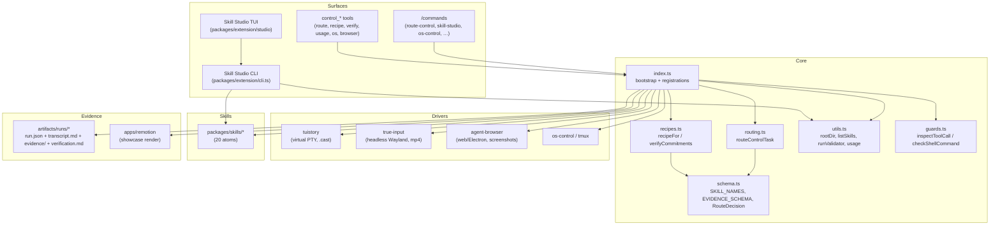
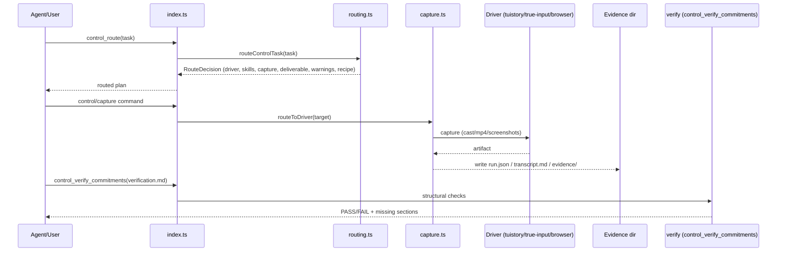

# Architecture

## Component map

## Execution flow

## Guard kernel

`guards.ts` hooks `pi.on("tool_call")` and inspects every shell-shaped tool call. `checkShellCommand` returns a block decision with a reason, or `null` when allowed.

Blocked patterns (non-exhaustive):

- `rm -rf` / `rm -fr` with `/`, `~`, `..`, `*`, `./` targets — full-path deletes require narrowing.
- `.env*` file access via read/write/edit tools (`cat`, `sed`, `grep`, `cp`, `>`, `tee`, `vim`, …).

Additional guards across the extension:

- `shellEscape` (utils.ts) — POSIX/Windows-safe quoting for any shelled-out argument.
- `showcaseRender` — rejects `..` / absolute path traversal in capture/out paths.
- Skill-name validation (`/^[a-zA-Z0-9_-]+$/`) everywhere a skill name is accepted.
- Bridge (`bridge.ts`) — WebSocket control plane authenticated with a token at `~/.config/devin/bridge-token`, compared with `timingSafeEqual`.
- `control_shell_command` tool — command allowlist, sensitive-path blocklist, cwd restriction (see `tools/shell_command.ts`).
- `runValidator` executes `scripts/validate-package.py` from `PACKAGE_ROOT` with no parameter injection.

## Skill registry & Skill Studio

- Bundled atoms live in `packages/skills/<name>/SKILL.md`; the registry (`listSkills` in utils.ts) reads name + description, memoized per base dir.
- The Studio scans `packages/skills` as the `pi` source, plus user trees `~/.agents/skills` (global), `~/.devin/skills`, `~/.claude/skills`.
- Shadow semantics: a user skill with the same name as a bundled skill is `overrides` (or the bundled one is `shadowed`). Same-name skills across user dirs are collapsed to one row (preferring `~/.agents`).
- State (disabled set, merge records) persists in `~/.config/devin/skill-studio.json`.
- `skill-merge.ts` implements a naive line-by-line 3-way merge (git merge-base when available) with `<<<<<<< PI` / `>>>>>>> USER` conflict markers, plus `/skill-merge-resolve --pi|--user|--manual`.

## Observation & cost

`buildUsageReport` (utils.ts) computes billable input = `promptTokens − cachedInputTokens`, then input/output cost from per-million rates. `control_usage` returns the text report plus a `details` object. The OCD advice: text snapshots before mp4, and verify before rerunning a capture loop.