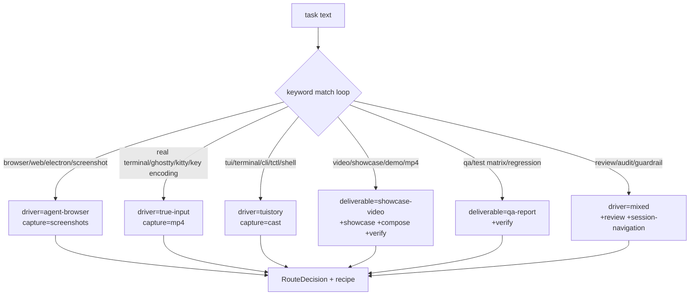

# Routing Logic

`routeControlTask(task, deliverableHint)` in `packages/extension/routing.ts` turns free text into a typed `RouteDecision`.

## Decision shape

```ts
type RouteDecision = {
  driver: "tuistory" | "true-input" | "agent-browser" | "mixed";
  skills: ControlSkillName[];        // subset of SKILL_NAMES
  capture: "cast" | "mp4" | "screenshots" | "report";
  deliverable: "qa-report" | "proof-report" | "showcase-video" | "browser-proof";
  warnings: string[];
  recipe: string[];                  // ordered execution steps
};
```

## How it works

1. Input = `task + deliverableHint` lowercased.
2. Start state: driver `tuistory`, capture `report`, deliverable `proof-report`, skills `["agy-agent-control"]`.
3. Every rule in `ROUTE_RULES` that matches adds to the state — **later rules can override earlier ones** (e.g. a `tui` rule sets driver `tuistory`, then a `browser` rule overrides to `agent-browser`).
4. Post-pass: color warnings for tuistory captures, `--repo-root` warning for tctl launches.
5. Skills are deduped and filtered against `SKILL_NAMES`; a canned recipe is built from driver/deliverable/capture.



## Keyword rules (selection)

| Keywords | Effect |
|---|---|
| `browser`, `web`, `electron`, `screenshot`, `visual qa` | driver `agent-browser`, capture `screenshots`, deliverable `browser-proof` |
| `real terminal`, `ghostty`, `kitty`, `wezterm`, `escape sequence`, `key encoding` | driver `true-input`, +`true-input` `pty-capture`, capture `mp4` |
| `tui`, `terminal`, `cli tool`, `tctl`, `snapshot`, `command`, `shell`, `bash` (+ `!browser`, `!web`) | driver `tuistory`, +`tuistory` `capture`, capture `cast` |
| `video`, `showcase`, `demo`, `before/after`, `mp4` | deliverable `showcase-video`, +`showcase` `compose` `verify` |
| `qa`, `test matrix`, `regression`, `checklist` | deliverable `qa-report`, +`verify` |
| `review`, `audit`, `guardrail`, `safety` | driver `mixed`, +`review` `session-navigation` |
| `ralph`, `consensus`, `hardening review` | driver `mixed`, +`ralph` |
| `computer use`, `os control`, `desktop automation`, `native input` | driver `agent-browser`, +`background-pty`, experimental warning |
| `background pty`, `detached session`, `long running` | +`background-pty` |
| `run`, `execute`, `task`, `start`, `launch` | catch-all: ensures tuistory skills loaded for generic inputs |

**Negative keywords:** prefix a keyword with `!` (e.g. `"!browser"`) to exclude the rule when that term is present. Word-boundary regexes are compiled once and cached per session.

## Recipes

`recipeFor(kind)` in `recipes.ts` returns canonical shell:

- `tuistory-launch` — `tctl launch` with `--backend tuistory`, `--cols 120 --rows 36`, `FORCE_COLOR=3 COLORTERM=truecolor`, snapshot + trim into `artifacts/runs/…/evidence/`.
- `browser-loop` — `agent-browser open → wait networkidle → snapshot -i → click → snapshot` per step (refs invalidate after navigation).
- `showcase-compose` — remotion install + `render-showcase.sh --props … --out …` + `ffprobe` verification.
- `qa-report` — step/expected/observed/PASS-FAIL/evidence table template.

## Surfaces

- **Tool:** `control_route` (full structured decision incl. `recipe` array).
- **Command:** `/route-control <task>` (markdown table + numbered recipe).
- **Inline:** `capture.ts routeToDriver` reuses the router for URL targets (`^https?://` → agent-browser) and otherwise routes by task text.